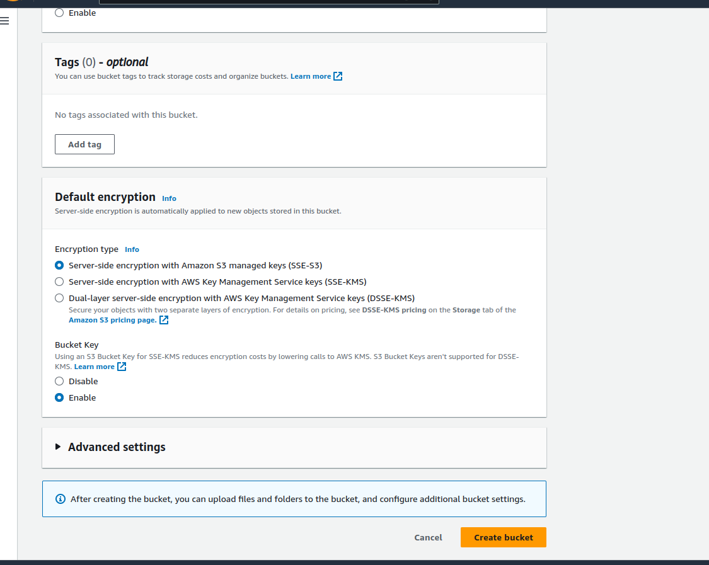
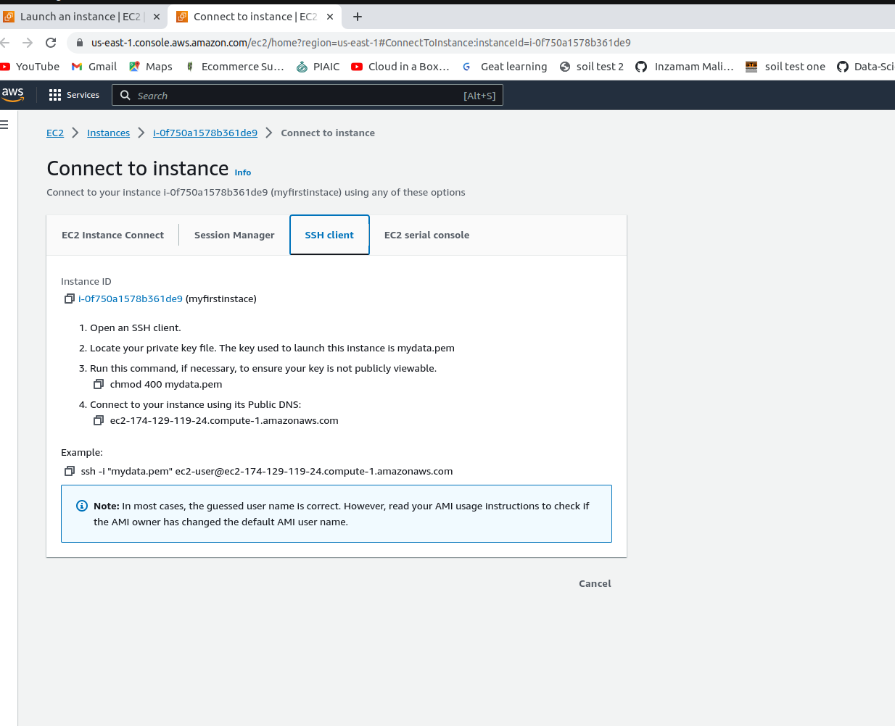

# Stock Market Kafka Real Time Data Engineering Project usinfg Kafka ,AWS S3 an Snoflake Cloud

## Introduction 
In this project, you will execute an End-To-End Data Engineering Project on Real-Time Stock Market Data using Kafka.

We are going to use different technologies such as Python, Amazon Web Services (AWS), Apache Kafka, Glue, Athena,SQL and Snowflake

## Architecture 

## Technology Used
- Programming Language - Python
- Amazon Web Service (AWS)
1. S3 (Simple Storage Service)
2. Athena
3. Glue Crawler
4. Glue Catalog
5. EC2 or Local Machine
6. Apache Kafka
7. Snowflake

## Dataset Used
You can use any dataset, we are mainly interested in operation side of Data Engineering (building data pipeline) 

Here is the dataset used in the video - https://github.com/MuhammadMudassirRaza12345/stock-market-kafka-snowflake-data-engineering-project/blob/main/indexProcessed.csv

## Follow the below Process  :  

    1)First step is to create S3 bucket:

 
   
    2)Second Step is  create role for glue : 

        1)Go IAM and Click to create role
        2)Select glue 
        3)Then Add permissions :
            a)AmazonS3FullAccess
            b)AWSGlueServiceRole    
            below click to next
        4)Write your role name e.g:`de-glue-S3-role`
        Then click on create role 

 

    Now if you want work on ec2 instance machine then first create ec2 instance machine if not want to run ec2 then move forward

 

    Then click to launch instances

 

    Then click on create new keypair
     

 

    write pair name
    
 

    Then click to create and mydata.pem file download in computer.Put this file to this project folder.
 

    click to launch instance and instance create
 

    Click to connect to your instance --> connect to instance

 

    Go to vscode and do as in pic

 

 

    go to security then  inbound rules go to security groups and click link 

 

    Then click on edit inbound rules
   
    
   

   

 
    
    Then click on Add rule and select as i do below pic and click on save rules

 

 

    Now go back vs code terminal where your instance connect

    Note: EC2 part end
 
    Now do the following the below steps (for both local and ec2 applicable)
     

    If you not work on ec2 then must create virtual enviroment (only for local machine do this)
       
    sudo pip3 install python3 (if python not download)
    sudo pip3 install virtualenv
    sudo virtualenv venv
    sudo source venv/bin/activate
    deactivate (For enviroment deactivate)

 
    
        ---Download kafka----

    wget https://downloads.apache.org/kafka/3.5.0/kafka_2.13-3.5.0.tgz 
    tar -xzf kafka_2.13-3.5.0.tgz 

 
   
     -----------------------Install java ---------
    sudo apt update
    sudo apt install default-jre      or sudo yum install java-1.8.0-openjdk
    java -version 

 

        ---Now Start Work on Kafka--------

    cd kafka_2.13-3.5.0/ 

 

        Start Zoo-keeper:
    -------------------------------
    bin/zookeeper-server-start.sh config/zookeeper.properties

    -- Open another windowor terminal to start kafka
    

    Start Kafka-server:
    ----------------------------------------
    Duplicate the session & enter in a new console --
    export KAFKA_HEAP_OPTS="-Xmx256M -Xms128M"      (if you work on ec2 then do this otherwise on local machine no need)

    -- Go to Terminal 
    cd kafka_2.13-3.5.0/  

    bin/kafka-server-start.sh config/server.properties

 

     -- if you work on EC2 then do following:
       It is pointing to private server , change server.properties so that it can run in public IP .
       The solution is to put public ip of ec2 is need to put .(Public IPv4 address)

    copy ip and put it as tell below

    --then go to terminal 
    cd kafka_2.13-3.5.0/ 

    Do a "sudo nano config/server.properties" - change ADVERTISED_LISTENERS to public ip of the EC2 instance 

    -- go to terminal

    cd kafka_2.13-3.5.0/ 
    
    -- Run kafka again
    bin/kafka-server-start.sh config/server.properties

    Note: But if you work on your own machine the above issue not come

    Create the topic:
    -----------------------------
    Duplicate the session & enter in a new console --
    cd kafka_2.13-3.5.0/  

    bin/kafka-topics.sh --create --topic demo_testing2 --bootstrap-server {localhost or Put the Public IP of your EC2 Instance:9092} --replication-factor 1 --partitions 1

    (localhost for your machine and public IP when you used ec2)

    Start Producer:
    --------------------------
    bin/kafka-console-producer.sh --topic demo_testing2 --bootstrap-server {localhost or Put the Public IP of your EC2 Instance:9092} 
    (localhost for your machine and public IP when you used ec2)

    Start Consumer:
    -------------------------
    Duplicate the session & enter in a new console --

    cd kafka_2.13-3.5.0/  

    bin/kafka-console-consumer.sh --topic demo_testing2 --bootstrap-server {localhost or Put the Public IP of your EC2 Instance:9092}
    (localhost for your machine and public IP when you used ec2)
    
    ----Then go in new console------
    Download jupyter : https://jupyterlab.readthedocs.io/en/stable/getting_started/installation.html
    pip3 install jupyterlab
    jupyter lab

    Note : When you change the console don't forget to activate virtual enviroment in local machine

    Now run producer.ipynb
     put the things accordingly as mention in comment
    then run consumer.ipynb
    put the things accordingly as mention in comment

 
## The Steps on AWS:

    1)Go to glue click on create crawler
        1)Add data source (your bucket path) then next
        2)Then select role which you create e.g:`de-glue-S3-role`
        3)select database 
                1)create database
                2)give the name of your database e.g:stock_data
                3)create
            Then select the database which you create and next
        4)select run on demand and create
        5)After that when crawler create then click run crawler
        6Then go database from left --> stock_data -->Table data  -->proceed to athena 
          -->on athena select 
                     Data source =AwsDataCatalog
                     Database=stock_data
                    then you click to three dots   and select preview table

## Now I   used Snowflake for dataware house for querry and analysis (work same as athena and glue)
    I used snowpipe here to automate the ingest.

    https://docs.snowflake.com/en/user-guide/data-load-snowpipe-auto-s3

    Follow the above documents for the steps of configuration with aws and snowflake
    -- First i done initial steps to configure aws and snowflake

    CREATE STORAGE INTEGRATION s3_int
    TYPE = EXTERNAL_STAGE
    STORAGE_PROVIDER = 'S3'
    ENABLED = TRUE
    STORAGE_AWS_ROLE_ARN = 'your arn role'
    STORAGE_ALLOWED_LOCATIONS = ('s3://your bucket name');

    DESC INTEGRATION s3_int;

    -- Now i create a database with name snowpipe_db
    CREATE OR REPLACE DATABASE snowpipe_db

    -- use the above created database
    USE SCHEMA snowpipe_db.public;

    -- Connect snowflake to data source(with AWS S3 bucket)
    CREATE STAGE mystage
    URL = 's3://kafka-stock-market-video-mudassir/'
    STORAGE_INTEGRATION = s3_int;

    show stages  

    -- now create a table with name mytable with columns json_text VARIANT (means data comes in json)
    CREATE OR REPLACE TABLE snowpipe_db.public.mytable(json_text VARIANT);

    create pipe snowpipe_db.public.mypipe auto_ingest=true as
    copy into snowpipe_db.public.mytable
    from @snowpipe_db.public.mystage
    file_format = (type = 'JSON');  

    show pipes  

    
    -- Now select table and check data come in it or not 
    select * from snowpipe_db.public.mytable;

 

## For issue in configuration with snowflake you can watch the below video    
Video Link - https://www.youtube.com/watch?v=uX3lbOgfNgo

## Complete Video Tutorial if you want do with ec2 (it will help to complete all buckets,glue,athena steps after that for snowflake follow above )

Video Link - https://www.youtube.com/embed/KerNf0NANMo

<!-- -- select SYSTEM$PIPE_STATUS('snowpipe_db.public.mytable'); -->
